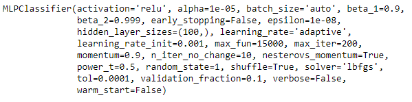

# MachineLearning
Binary Classification of images

Classification of images into two categories of memorable or not memorable. 

I achieved an accuracy of 71.446% on the test images using an MLP Classifier

    Multi-layer Perceptron classifier

